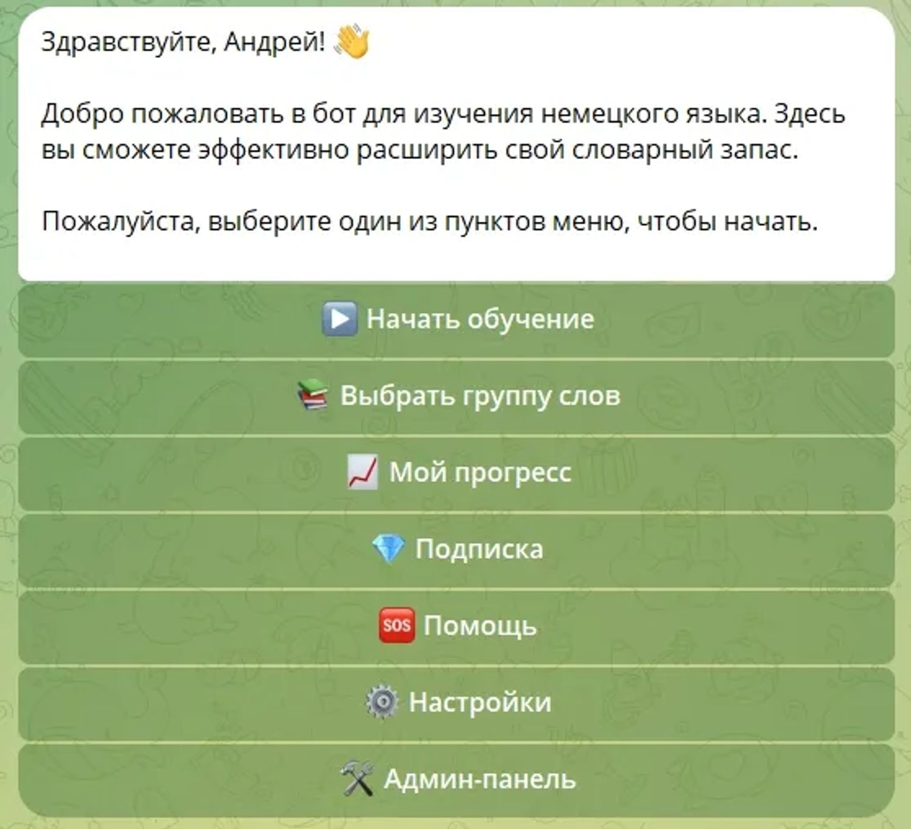
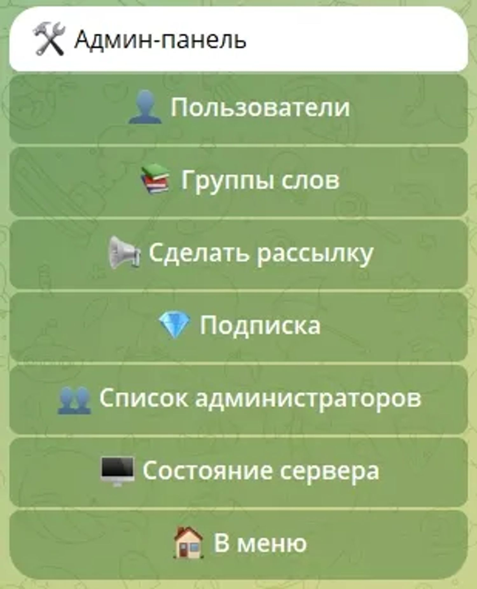
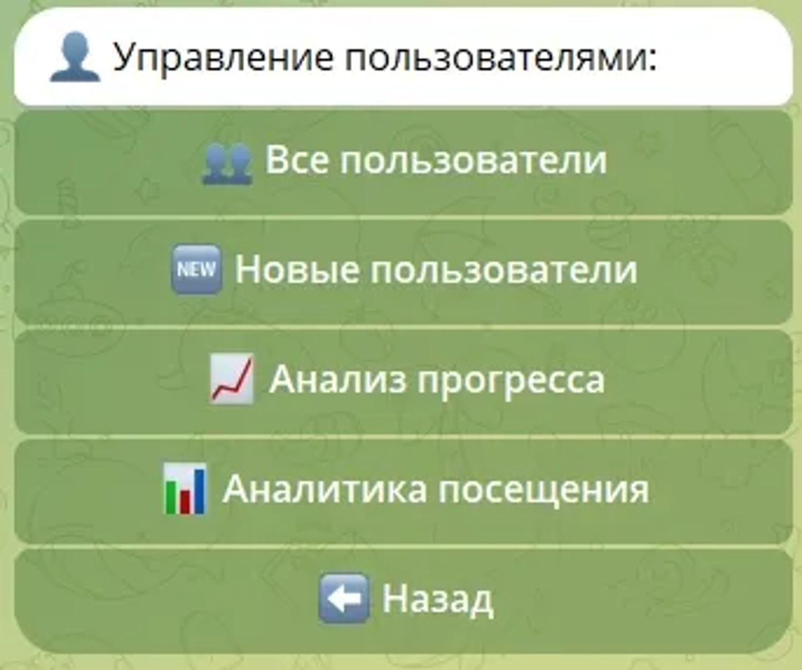
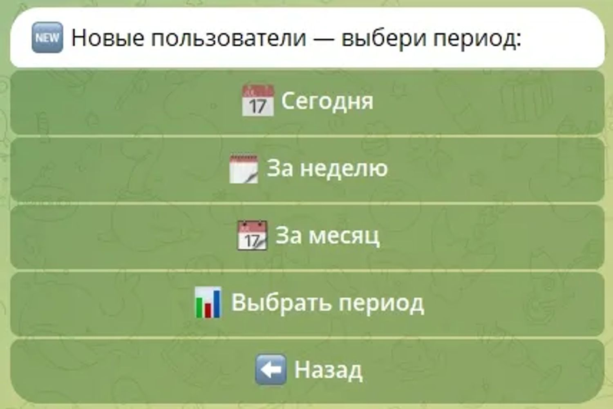
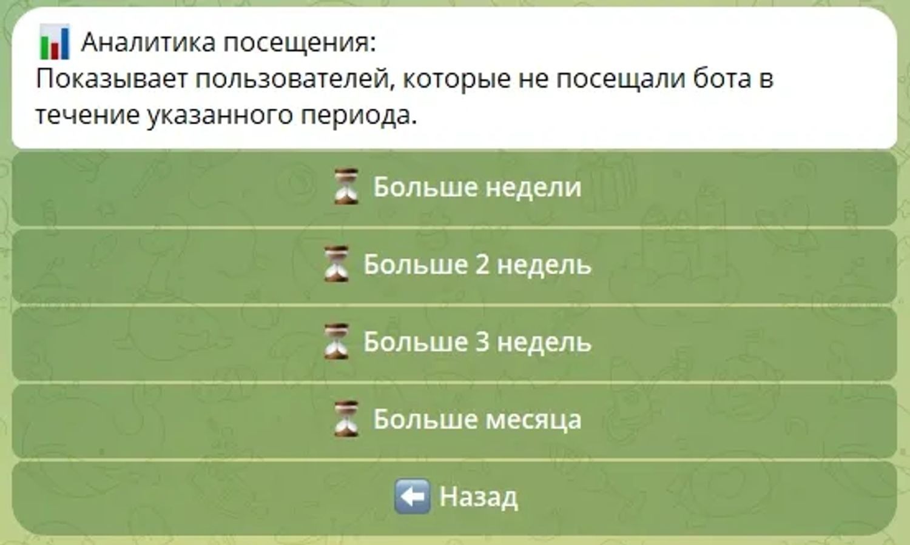
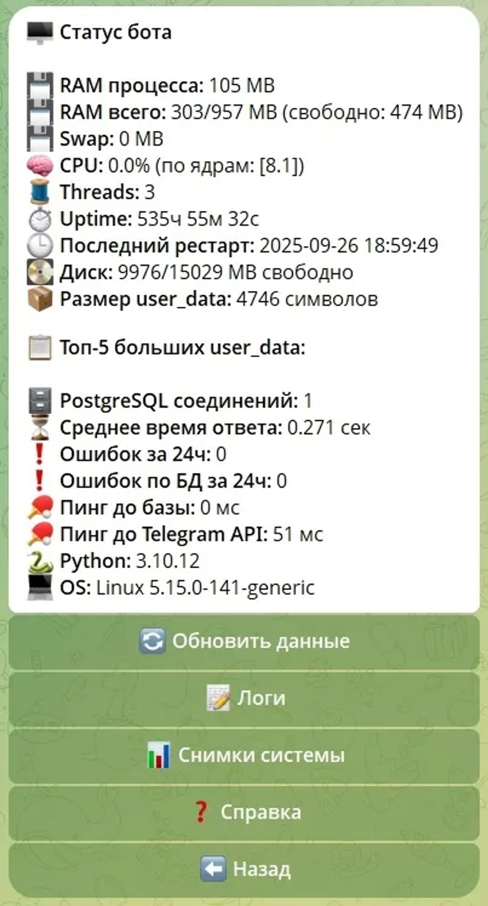
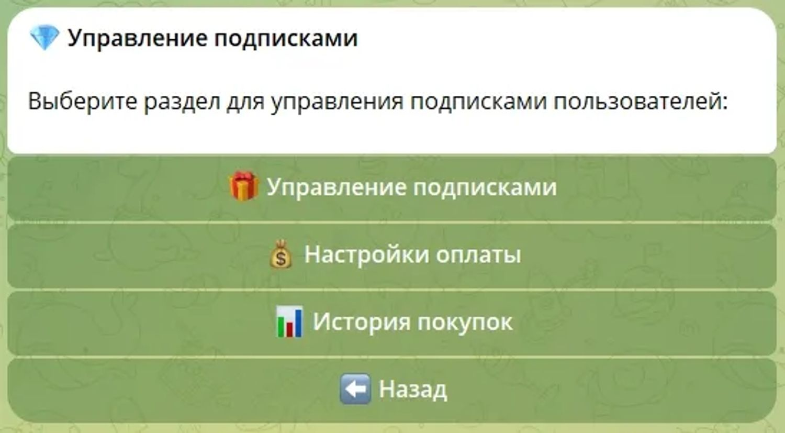

# TGTeacher

Telegram-бот для изучения иностранных языков с системой прогресса, многоэтапным обучением и подписочной моделью.

### Возможности:
- Обучение по этапам с сохранением прогресса
- Работа с лексическими группами
- Админ-панель (управление контентом и пользователями)
- Интеграция платежей (YooKassa)
- PostgreSQL для хранения данных

### Стек:
Python, aiogram, PostgreSQL, Docker

Проект реализует full-cycle разработку: от архитектуры до деплоя и поддержки.


## Скриншоты

### Главное меню
Стартовый экран бота: навигация по обучению, выбор групп слов, прогресс, подписка (ЮKassa).  
Админ-панель доступна только администраторам.


---

### Админ-панель
Центральное управление системой: пользователи, группы слов, рассылки, тарифы подписки и мониторинг состояния бота.


---

### Пользователи
Управление пользователями: прогресс, подписки, персональные рассылки, анализ активности и экспорт данных в Excel.


---

### Новые пользователи
Аналитика новых пользователей по периодам с возможностью выгрузки в Excel.


---

### Неактивные пользователи
Список пользователей, давно не заходивших в бота.


---

### Состояние системы
Мониторинг сервера и бота: логи, статус, снимки системы каждые 5 минут, диагностика состояния.


---

### Подписки
Управление подписками: тарифы, массовое продление, история платежей, интеграция YooKassa.



### Архитектура
Проект разделён на слои: handlers, services, repositories (DB), utils.
Это позволяет масштабировать функциональность и поддерживать код.

## Актуальная структура проекта

```text
TGTeacher/
├─ bot/
│  ├─ main.py                       # Точка входа (оставлена совместимость)
│  ├─ .env.example
│  ├─ admins.txt
│  ├─ help_questions_index.json
│  ├─ exports/
│  ├─ scripts/
│  │  ├─ add_test_users.py
│  │  ├─ seed_payments.py
│  │  └─ clear_families.py
│  └─ tgteacher_bot/
│     ├─ core/                      # app, paths, базовая конфигурация запуска
│     ├─ db/                        # pool + репозитории БД
│     ├─ handlers/
│     │  ├─ user/                   # пользовательские хендлеры и stage_*
│     │  └─ admin/                  # админ-хендлеры
│     ├─ services/
│     │  ├─ payments/               # платежи/подписки
│     │  ├─ exports/                # экспорт/загрузка групп слов
│     │  └─ legacy/                 # служебные фоновые задачи/снапшоты
│     └─ utils/                     # общие утилиты
├─ families/                        # Контент групп слов (txt + media)
├─ requirements.txt
├─ Dockerfile
└─ docker-compose.yml
```

## Требования

- Python 3.10+ (рекомендуется 3.11/3.12)
- PostgreSQL 14+
- `pip`
- (опционально) Docker + Docker Compose

## Локальный запуск

1. Создать виртуальное окружение:
   - `python -m venv .venv`
   - Windows: `.venv\\Scripts\\activate`
2. Установить зависимости:
   - `pip install -r requirements.txt`
3. Подготовить файл переменных окружения:
   - создать `bot/.env` на основе `bot/.env.example`
4. Обеспечить доступность PostgreSQL и наличие базы данных (по умолчанию `tgteacher`).
5. Запустить приложение:
   - `python bot/main.py`

## Переменные окружения

Основные:

- `BOT_TOKEN` — токен Telegram-бота (обязательно).
- `HELP_QUESTIONS_GROUP_ID` — идентификатор группы (chat_id) для пересылки вопросов из раздела помощи (опционально).

Параметры БД:

- `POSTGRES_USER` (default: `postgres`)
- `POSTGRES_PASSWORD` (default: пусто/или задан в окружении)
- `POSTGRES_DB` (default: `tgteacher`)
- `POSTGRES_HOST` (default: `127.0.0.1`)
- `POSTGRES_PORT` (default: `5432`)

## Запуск через Docker

1. Подготовить файл `.env` в корне проекта (как минимум `BOT_TOKEN`; при необходимости — параметры БД).
2. Выполнить запуск:
   - `docker compose up --build`

Сервисы:

- `db` — PostgreSQL 16.
- `bot` — контейнер приложения, запускает `python bot/main.py`.

## Проверка, что всё работает

- Проверка компиляции:
  - `python -m compileall bot`
- Проверка импорта entrypoint:
  - `python -c "import sys; sys.path.insert(0, 'bot'); import main"`

При возникновении `ModuleNotFoundError` (например, `pyzipper`) необходимо установить зависимости в текущем окружении: `pip install -r requirements.txt`.

## Данные и контент

- Папка `families/` содержит учебный контент и медиа.
- Runtime-данные:
  - `bot/exports/` — выгрузки.
  - `runtime_cache/` — временный кэш.
  - `bot/help_questions_index.json` — индекс пользовательских вопросов.

## Скрипты обслуживания

- `python bot/scripts/add_test_users.py` — добавление тестовых пользователей.
- `python bot/scripts/seed_payments.py` — генерация тестовых платежей.
- `python bot/scripts/clear_families.py` — удаление всех семей слов из базы данных (требуется подтверждение).
